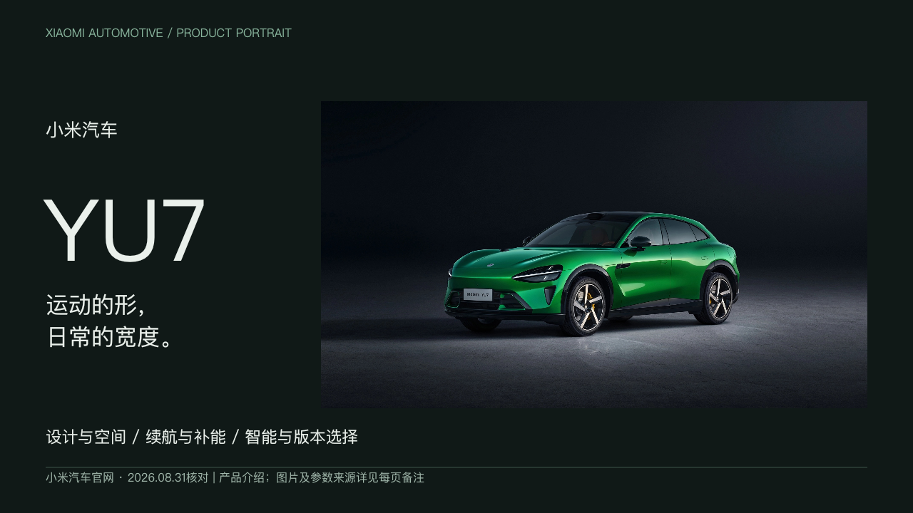
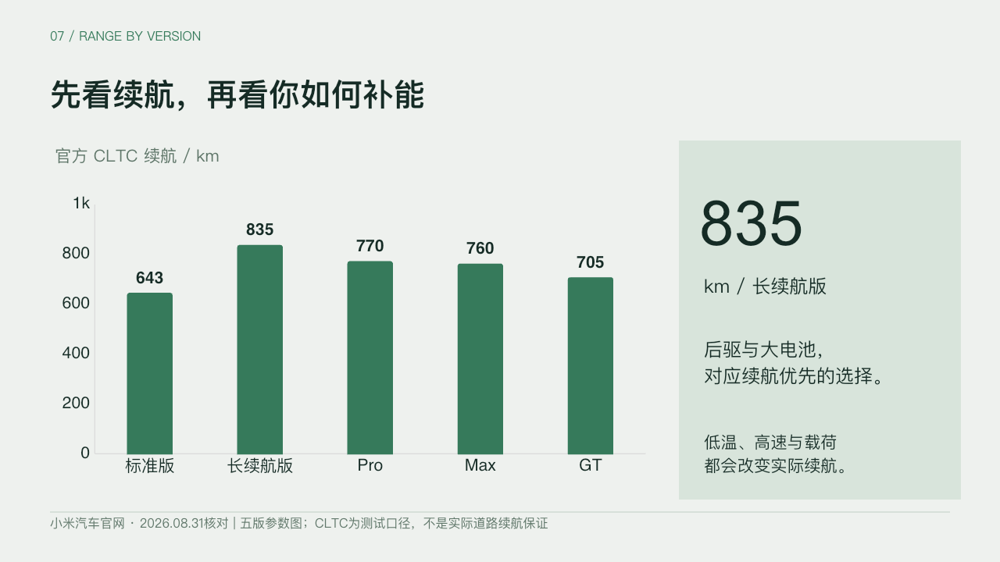
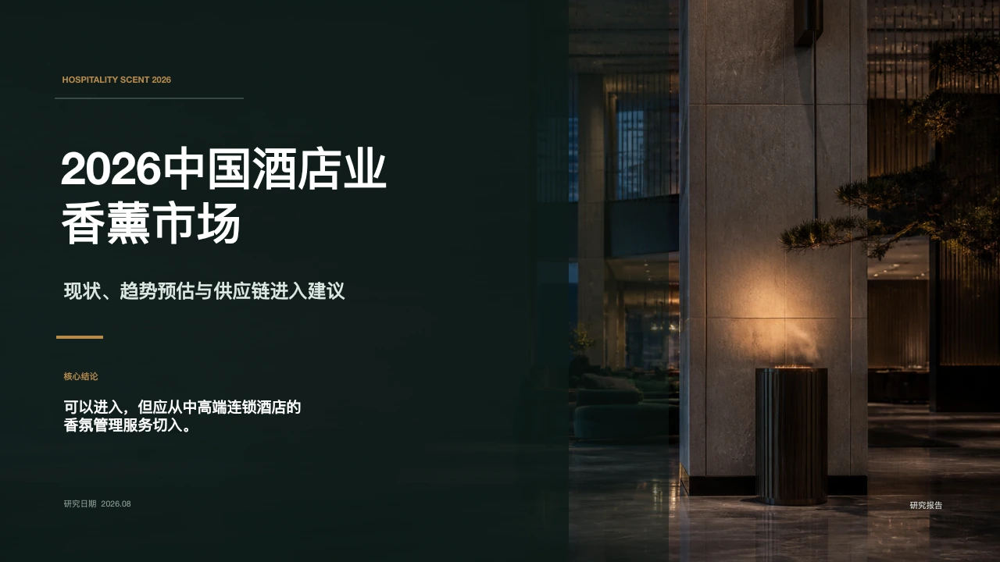
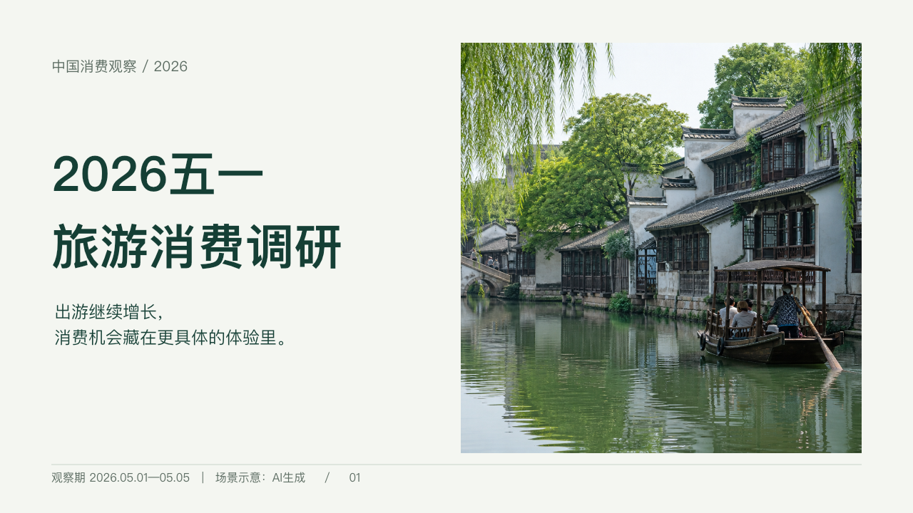
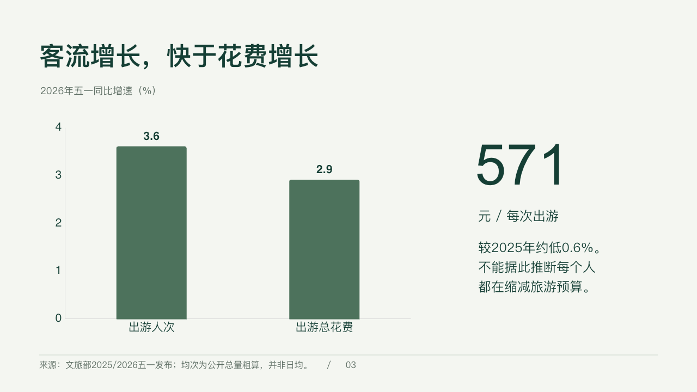
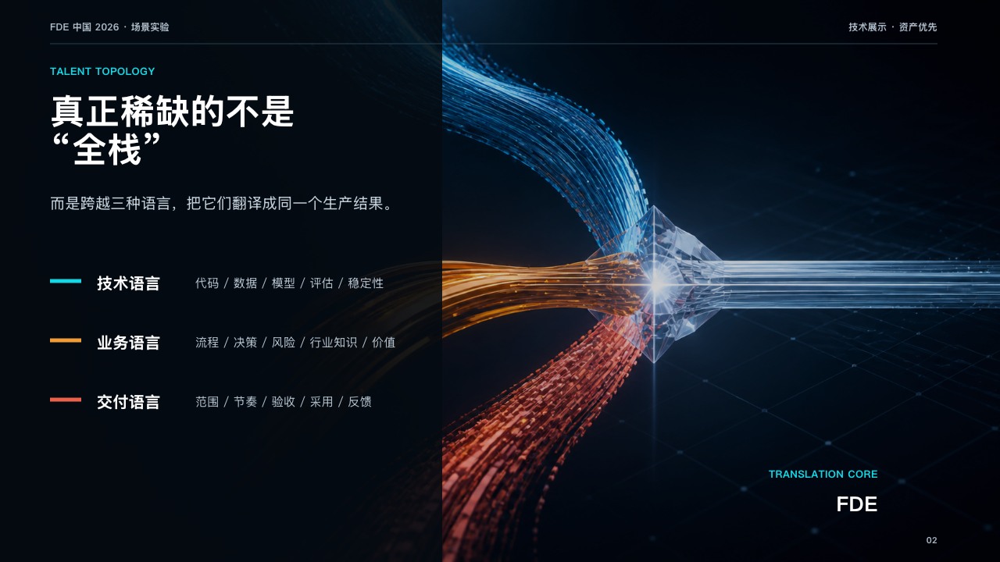
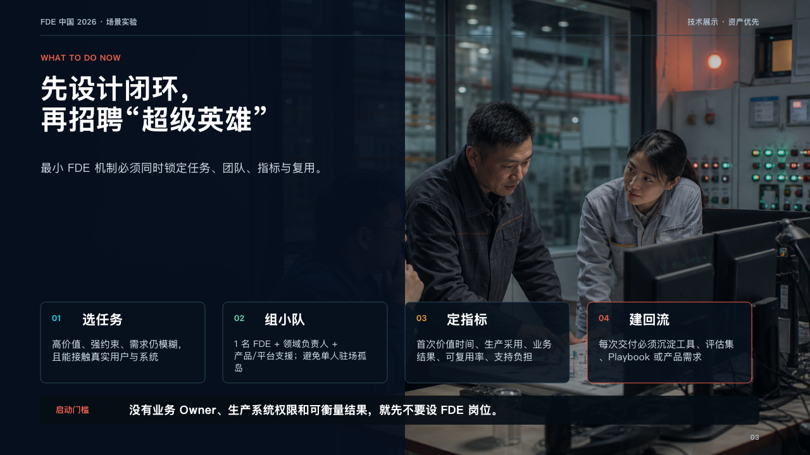

# Slidethus v0.8.1 — Evidence-backed Presentation Engineering

从一个主题到一套有依据、有设计的 PPT。

## 小米 YU7 · 产品介绍





## 中国酒店业香薰市场 · 低奢研究报告



## 五一旅游消费 · 调研报告





## FDE 与 AI 生产落地 · 技术展示





案例来自不同阶段的真实任务，并非同一版本的统一验收集。[案例说明与素材出处](docs/showcase/README.md)

## 开始使用

从 [Releases](https://github.com/rv198-star/Slidethus/releases/latest) 下载 Wheel，然后：

```bash
python -m pip install slidethus-0.8.1-py3-none-any.whl
slidethus plugin install-skill /absolute/path/to/project
```

在支持技能的 Agent 中直接说：

> 使用 $using-slidethus，制作一份介绍小米 YU7 的 PPT。

[发布说明与能力边界](release/v0.8.1.md) · [工作流程](docs/03-workflow-state-machine.md) · [架构](docs/02-architecture.md) · [开发路线](TASKS.md)

包版本：`0.8.1` · 本轮验证 Python 3.11 · [Apache-2.0](LICENSE)

<details>
<summary>版本与能力边界</summary>

M5 Exit Gate：PASS（工程边界）；M6.6 尚未完成，不声明 v1.0 发布就绪。外部工具依赖（capability boundary）与 Office 验收限制见[发布说明](release/v0.8.1.md)。

</details>

案例图片不按代码许可证再授权，第三方权利见[说明](THIRD_PARTY_NOTICES.md)。
