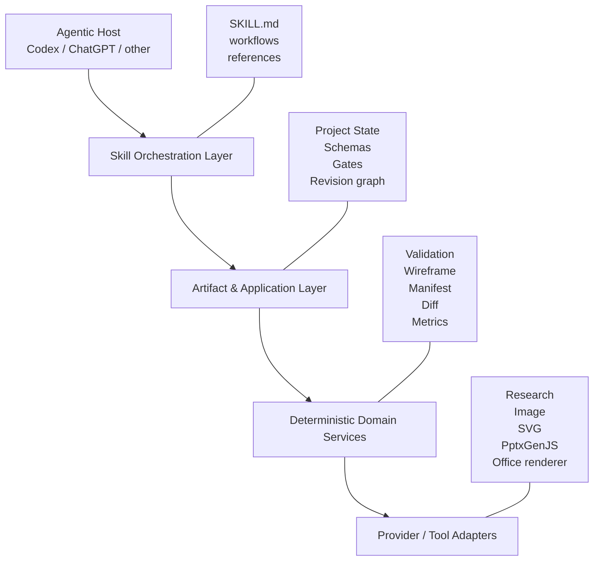
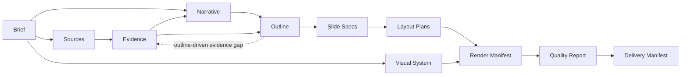

# 02｜Architecture

## 1. 架构目标

Slidethus 需要同时满足：

- 可作为 Codex/ChatGPT 的 Skill 使用；
- 可在没有专用 UI 的情况下本地运行；
- 可替换模型、搜索、图片和渲染供应商；
- 可中断、恢复和局部返工；
- 可审计事实、叙事、页面、视觉和交付；
- 可从基础脚本逐步演进为 Plugin 或独立产品。

## 2. 四层结构



### 2.1 Skill Orchestration Layer

职责：

- 识别任务类型；
- 判断宿主能力；
- 选择 Workflow；
- 决定阶段顺序、审批点和降级方式；
- 调用脚本或工具；
- 处理失败、返工和交付。

该层不保存事实真相。事实必须写入结构化 artifacts。

### 2.2 Artifact & Application Layer

职责：

- 项目状态与阶段迁移；
- Artifact registry 和版本；
- Schema 与跨引用校验；
- Gate 执行；
- 局部返工影响分析；
- 决策、假设和问题日志。

这是 Slidethus 的长期核心资产。

### 2.3 Deterministic Domain Services

职责：

- 文件哈希、路径与 manifest；
- JSON 校验；
- ID 与引用检查；
- 文字密度、几何边界和布局规则；
- wireframe 生成；
- 输出完整性与回归差异；
- 可重复的质量检查。

确定性任务优先由该层完成，不浪费模型推理。

### 2.4 Provider / Tool Adapters

职责：

- 文件解析；
- 搜索与网页读取；
- LLM 推理；
- 图片/图标/图表生成；
- SVG/PPTX 渲染；
- Office/PDF/PNG 导出；
- 视觉理解和 OCR（最后手段）。

适配器只能依赖领域协议，不能反向污染领域 Schema。

## 3. 单主编排器

Slidethus 默认只有一个主编排器。原因：

- 需求、事实、叙事和设计之间存在强依赖；
- 多个写代理会造成版本冲突和责任模糊；
- 自然语言代理间传递容易丢失事实；
- 大部分“角色”更适合作为阶段 Workflow，而不是独立 Agent。

允许使用子代理的场景：

- 多文件只读探索；
- 不同来源的并行研究；
- 相互独立的审计维度；
- 测试日志和缺陷分析。

限制：

- 主代理保留决策权和 artifact 写入权；
- 子代理返回结构化摘要，不直接合并冲突写入；
- 并行写任务必须文件不重叠并有显式合并策略。

## 4. 依赖方向

```text
Skill instructions
      ↓
Application use cases
      ↓
Domain models / protocols
      ↓
Deterministic services
      ↑
External adapters implement protocols
```

领域层不得 import 具体供应商 SDK。

## 5. 工作区模型

建议每个 deck 使用独立工作区：

```text
<project>/
├── project_state.json
├── brief/project_brief.json
├── sources/source_ledger.json
├── evidence/evidence_ledger.json
├── narrative/narrative_blueprint.json
├── outline/deck_outline.json
├── slides/slide_specs.json
├── layout/layout_plans.json
├── design/visual_system.json
├── assets/asset_manifest.json
├── renders/render_manifest.json
├── review/quality_report.json
├── delivery/delivery_manifest.json
├── decisions/
├── cache/
└── outputs/
```

输入素材默认只读，生成资产写入工作区。

## 6. Artifact graph



局部变更通过依赖图决定返工范围。例如：

- 修改颜色 Token：重跑视觉与渲染，不重跑证据和叙事；
- 修改事实：更新 Evidence，并回归所有引用该 evidence ID 的页面；
- 调整受众：通常从 Narrative 开始重审；
- 修改单页布局：只重跑该页的 Layout、Render 和视觉回归。

## 7. Provider protocols

基础协议包括：

- `SourceParser`
- `ResearchProvider`
- `ReasoningProvider`
- `AssetProvider`
- `ChartProvider`
- `RenderBackend`
- `DocumentRenderer`
- `VisualReviewProvider`

协议输入输出必须使用领域 DTO 或 artifact refs，不能以任意长文本为唯一合同。

## 8. 渲染策略

渲染采用多后端：

1. **Wireframe SVG**：确定性灰模，验证策划稿；
2. **Final SVG**：高视觉自由度；
3. **PPTX Native**：可编辑文本、形状和图表；
4. **Hybrid PPTX**：原生基础对象 + 复杂 SVG/图片；
5. **Preview Renderer**：PPTX/PDF → PNG，用于视觉审计。

逻辑坐标统一为 `1280×720`，后端负责转换到目标单位。

## 9. 配置层

配置优先级：

1. 内置安全默认值；
2. 仓库级配置；
3. 项目级 `project_brief`；
4. 当前 Workflow 参数；
5. 用户明确覆盖。

不把模型名称、API Key 或供应商写入 artifact 事实层。

## 10. 可观测性

后续里程碑应记录：

- phase/gate 开始与结束；
- artifact 版本；
- provider 调用与缓存命中；
- token/时间/成本预算；
- 重试原因；
- 修复影响范围；
- 最终质量和已知风险。

日志不能包含不必要的敏感输入或密钥。

## 11. 未来分发

当前仓库通过 `.agents/skills/slidethus` 供本地 Codex 自动发现。稳定后可把 Skill、脚本、资产和可选连接器封装为 Plugin；领域核心保持独立 Python 包，避免分发形态反向绑定架构。
