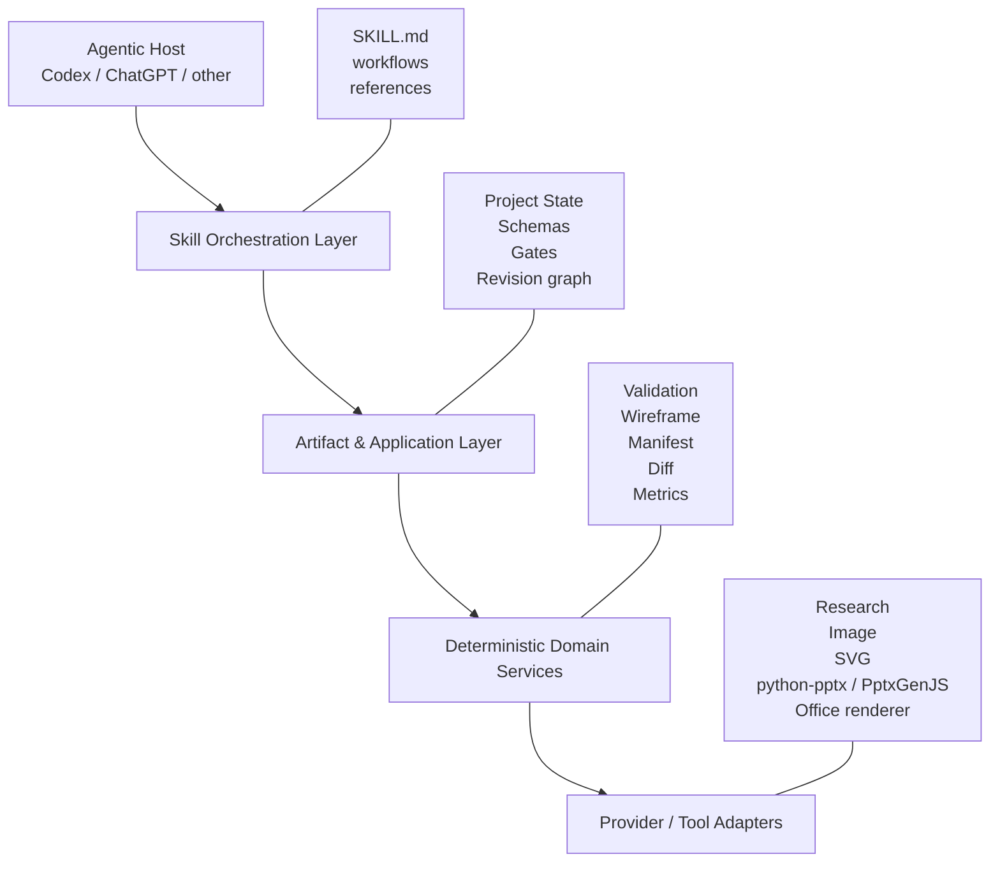
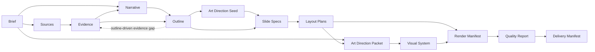

# 02｜Architecture

## 1. 架构目标

Slidethus 需要同时满足：

- 可作为 Codex/ChatGPT 的 Skill 使用；
- 可在没有专用 UI 的情况下本地运行；
- 可替换模型、搜索、图片和渲染供应商；
- 可中断、恢复和局部返工；
- 可审计事实、叙事、页面、视觉和交付；
- 可从基础脚本逐步演进为 Plugin 或独立产品。

## 2. 四层结构



### 2.1 Skill Orchestration Layer

职责：

- 识别任务类型；
- 判断宿主能力；
- 选择 Workflow；
- 决定阶段顺序、审批点和降级方式；
- 调用脚本或工具；
- 处理失败、返工和交付。

该层不保存事实真相。事实必须写入结构化 artifacts。

`using-slidethus` 为统一入口；brief/research/story/plan/design/render/review 七个阶段 Skill 由同一主 Agent 按需读取，分别覆盖 P0、P1/P2、P3/P4、P5A/P5B、P6、P7、P8/P9。完整任务自动继续，单阶段调用停在其请求边界。旧 `slidethus` 为兼容入口及共享资源目录，不构成第二编排器。Repo/Plugin/Wheel 一起分发全部技能，见 [ADR-0030](adr/ADR-0030-modular-skill-suite.md)。

### 2.2 Artifact & Application Layer

职责：

- 项目状态与阶段迁移；
- Artifact registry 和版本；
- Schema 与跨引用校验；
- Gate 执行；
- 局部返工影响分析；
- 决策、假设和问题日志。

这是 Slidethus 的长期核心资产。

### 2.3 Deterministic Domain Services

职责：

- 文件哈希、路径与 manifest；
- JSON 校验；
- ID 与引用检查；
- 文字密度、几何边界和布局规则；
- wireframe 生成；
- 输出完整性与回归差异；
- 可重复的质量检查。

确定性任务优先由该层完成，不浪费模型推理。

### 2.4 Provider / Tool Adapters

职责：

- 文件解析；
- 搜索与网页读取；
- LLM 推理；
- 图片/图标/图表生成；
- SVG/PPTX 渲染；
- Office/PDF/PNG 导出；
- 视觉理解和 OCR（最后手段）。

适配器只能依赖领域协议，不能反向污染领域 Schema。

## 3. 单主编排器

Slidethus 默认只有一个主编排器。原因：

- 需求、事实、叙事和设计之间存在强依赖；
- 多个写代理会造成版本冲突和责任模糊；
- 自然语言代理间传递容易丢失事实；
- 大部分“角色”更适合作为阶段 Workflow，而不是独立 Agent。

允许使用子代理的场景：

- 多文件只读探索；
- 不同来源的并行研究；
- 相互独立的审计维度；
- 测试日志和缺陷分析。

限制：

- 主代理保留决策权和 artifact 写入权；
- 子代理返回结构化摘要，不直接合并冲突写入；
- 并行写任务必须文件不重叠并有显式合并策略。

## 4. 依赖方向

```text
Skill instructions
      ↓
Application use cases
      ↓
Domain models / protocols
      ↓
Deterministic services
      ↑
External adapters implement protocols
```

领域层不得 import 具体供应商 SDK。

## 5. 工作区模型

建议每个 deck 使用独立工作区：

```text
<project>/
├── project_state.json
├── brief/project_brief.json
├── sources/source_ledger.json
├── evidence/evidence_ledger.json
├── narrative/narrative_blueprint.json
├── outline/deck_outline.json
├── slides/slide_specs.json
├── layout/layout_plans.json
├── design/visual_system.json
├── assets/asset_manifest.json
├── renders/render_manifest.json
├── review/quality_report.json
├── delivery/delivery_manifest.json
├── decisions/
├── .slidethus/
│   ├── transactions/
│   ├── history/
│   ├── research/runs/
│   ├── art-direction/packets/
│   ├── cache/ingestion/
│   └── cache/research/
├── cache/
└── outputs/
```

输入素材默认只读，生成资产写入工作区。

## 6. Artifact graph



局部变更通过依赖图决定返工范围。例如：

- 修改颜色 Token：重跑视觉与渲染，不重跑证据和叙事；
- 修改事实：更新 Evidence，并回归所有引用该 evidence ID 的页面；
- 调整受众：通常从 Narrative 开始重审；
- 修改单页布局：只重跑该页的 Layout、Render 和视觉回归。

## 7. Provider protocols

基础协议包括：

- `SourceParser`
- `ResearchProvider`
- `ReasoningProvider`
- `AssetProvider`
- `ChartProvider`
- `ArtDirectionProvider`
- `RenderBackend`
- `DocumentRenderer`
- `VisualReviewProvider`

协议输入输出必须使用领域 DTO 或 artifact refs，不能以任意长文本为唯一合同。

### 7.1 M2.1–M2.2 来源摄取边界

```text
local file
  → deterministic format detection
  → Parser Registry selection
  → SourceParser adapter
  → immutable input-keyed Source Snapshot
  → versioned Source Ledger reference
```

M2.1 将来源解析从 MVP 的内存函数升级为可恢复 ProductionImpl，M2.2 在同一边界内加入安全的格式适配器：

- `SourceParseRequest` 明确 source ID 与资源限额；
- `SourceParseResult` 返回 parser lineage、来源字节哈希、稳定 Chunk IDs、locator、`parsed/partial`、warning 和 source risks；
- Registry 对 unsupported 与同优先级歧义 fail closed；
- `.slidethus/cache/ingestion/` 快照先以 create-if-absent 方式发布，Source Ledger 再由 Artifact Runtime 事务提交引用；
- Source Ledger 的 parser、格式、限额、快照哈希和计数必须与快照相互校验；
- 同一 source ID 不能重绑到另一文件，同一路径不能再创建别名 ID；
- 来源不变时可复用解析快照，权限和使用策略修改仍产生新的 Source Ledger 版本；
- admitted adapters 覆盖 Markdown/TXT、HTML、PDF、DOCX、PPTX、CSV/TSV、XLSX 和常见图片元数据；
- HTML/CSV 使用标准库，PDF/DOCX/XLSX/图片能力通过 `slidethus[ingestion]` 可选依赖接入，缺依赖返回 capability failure；
- OOXML 在库打开前验证 ZIP 条目、单成员/总展开、重名、路径、symlink、加密、VBA、外部关系和嵌入对象；
- 页、段落、表格、幻灯片/形状、工作表/单元格和图片元数据使用格式原生 locator；
- 公式、宏、脚本、链接、嵌入文件和媒体永不执行；未解释的图片、评论、公式结构、SmartArt、音视频等把结果标为 `partial`；
- SVG、旧版 OLE、宏启用 OOXML、加密 PDF 和未知格式继续 fail closed。

`source_snapshot.schema.json` 属于运行时辅助事实，不是顶层可独立推进阶段的 artifact；它通过 Source Ledger 引用进入完整性图。详细决策见 ADR-0009 与 ADR-0010。

### 7.2 M2.3 Research Runtime 边界

```text
Project Brief / current Outline
  → deterministic Research Plan
  → provider-neutral ResearchProvider
  → resumable Research Run
  → immutable query-result cache
  → M2.4 source/evidence materialization
```

M2.3 把“主动研究”实现为独立运行时层，而不是把搜索结果直接写进 Evidence Ledger：

- orientation plan 绑定 Brief 的主题、目的、受众、freshness 与允许的外部来源等级；
- targeted plan 绑定当前 `deck_outline` 版本和具体 factual slides；
- `ResearchProvider` 必须声明 name/version，Run 与 Cache lineage 都绑定 provider identity；
- `.slidethus/research/runs/` 逐 task 记录 pending/running/complete/failed/blocked、attempts、cache 引用和错误，可在中断后 resume；
- `.slidethus/cache/research/` 使用不可变 content-addressed snapshots，并通过 generation marker 显式失效，旧快照不被覆盖；
- query、provider、freshness/source tiers、结果相关限额和 TTL 共同决定 cache input identity；
- offline capability 显式 blocked，不产生伪造结果；
- workspace validation 只读检查 Run/Cache 完整性，显式 inspect/resume 才允许执行恢复写入；
- `ResearchResult` 只是待评估研究候选，不等于 Source，也不等于 Evidence；M2.4 才负责来源物化、去重、冲突、时效、权威与支持关系判断。

`research_run.schema.json` 与 `research_cache_snapshot.schema.json` 是打包的运行时 Schema，但不是 Artifact Runtime 的阶段性 catalog artifacts。详细决策见 ADR-0011。

### 7.3 M2.4 Evidence Engine 边界

```text
Production Source Chunk / Research Result
  → EvidenceCandidate
  → exact claim identity + candidate bindings
  → support / conflict / authority / freshness / use-policy adjudication
  → versioned Evidence Ledger
```

M2.4 保持确定性核心的能力诚实：

- 本地已摄取来源按 Chunk 形成保守 Candidate；不把一般语义抽取伪装成确定性能力；
- Research Result 先物化为 `partial` Web Source Snapshot，明确 `remote_body_fetched=false`，再形成 indirect Candidate；
- `claim_key` 只合并保守的 exact-normalized duplicates，并保留百分比、单位、除法、十进制和正负号等语义符号；
- Production claim 持久化 `candidate_bindings`，绑定 Source/locator/Chunk/hash、Research Run/Result、conflict stance 与 freshness；
- `EVD-*` 只按新 claim key 递增分配，来源变化不会复用旧 ID 表示新事实；
- Source 更新允许提交，但旧 Evidence 变为 draft，G2 因 stale binding 阻断，Engine 再降级或重建事实；
- explicit conflict group 的 opposing stances 会传播到所有当前成员；无当前 opposing support 时重新裁决；
- Web Source URL 只接纳无凭据 HTTP(S)，同 URL 的不同 Research Results 合并保留，其他 ingestion owner 不被覆盖；
- semantic research cycle 只有在所有 Run complete、结果完成来源物化并获得可用 Evidence 后才 complete；重复完成是幂等的。

Source/Evidence 写入仍由 Artifact Runtime 事务和同一 body/version snapshot 的 optimistic lock 管理。详细决策见 ADR-0012。

### 7.4 M2.5 Block Evidence / Gap / Rework 边界

```text
current Outline + optional Slide Specs + current Evidence
  → explicit/conservative evidence requirements
  → block/slide binding analysis
  → immutable Evidence Gap Report
  → targeted Research Plan handoff or formal EVIDENCE_READY rework
```

- `evidence_requirement` 允许 Outline slide 和 content block 显式声明 required/optional/none；legacy artifacts 使用保守、可解释默认值；
- required block 必须绑定已知、可用 Evidence；provisional/inference/assumption 必须有 `evidence_qualification`；
- required slide 的 Evidence 必须落实到负责表达该事实的 block；
- Gap Report 绑定 Brief/Source/Evidence/Outline/Specs 的版本与 content hash，使用稳定 issue/query identity；
- query suggestion 只形成 M2.3 Research Plan，不等于执行研究或获得 Evidence；
- gap-free user-material路径可以幂等完成 query_count=0 的 targeted cycle；
- blocking gap 通过 Artifact Runtime 记录 Decision Log，并从 admitted planning phase 正式回到 `EVIDENCE_READY`。

详细决策见 ADR-0013。

### 7.5 M2.6 Application / Capability / Security 边界

```text
M2ApplicationService
  → SourceIngestionService
  → EvidenceEngine
  → injected ResearchProvider / explicit degradation
  → EvidenceBindingService
  → current G1/G2/G5A or auditable rework/block
  → immutable M2 Application Report
```

- CLI 不内置在线搜索供应商；在线 provider 只通过 protocol 注入；
- 实际 provider 调用还要求单独的 external-disclosure approval；
- external research 缺失默认 D5，只有显式批准且无 freshness 约束时才允许 D3 user-material degradation；
- high-severity Source risks 默认只进入 Source inventory，不自动提升为 Evidence；Evidence Engine 的直接 Source/Research CLI 也执行同一约束，显式 override 仍保持 provisional/qualified；
- 应用级 budget 同时覆盖 requested、current/final workspace Sources，以及 archived Research Run 的 query/result/metadata 限额；
- Research 物化新增 Web Source 后必须重新通过 G1，再进入 G2；
- M2 只重验证已有 Narrative/Outline/Specs，不生成或静默修改 M3 artifacts；
- `.slidethus/m2/runs/` 中的 content-addressed Report 绑定 Project State revision、artifact history、完整 config/security decisions、actions、Gate 与 gap output；Research Run 另以 `.slidethus/m2/research-runs/` 不可变快照绑定其 immutable cache lineage；所有运行时路径限制在工作区 admitted roots；它不是 Delivery Manifest。

详细决策见 ADR-0014。

### 7.6 M3 Narrative / Planning Production 边界

```text
M3ApplicationService
  → BriefCompletionService
  → M2 orientation / G2
  → NarrativePlanningService / G3
  → OutlinePlanningService + OutlineChangeService / G4
  → SlideSpecPlanningService
  → M2 targeted Evidence / G5A
  → LayoutPlanningService + immutable wireframes / G5B
  → PlanningReviewService / PlanningRepairService
  → immutable M3 Application Report
```

- `PlanningProvider` 只提议 bounded `PlanningProposal`；稳定 ID、Evidence admission、lineage、Gate、Artifact Runtime 写入由 deterministic services 接管；
- Production Narrative/Outline/Specs/Layout 统一携带 `PLN-*` lineage，绑定 current upstream artifacts、provider、proposal 与 policy；
- Outline 的 `S-*` 与 ordinal 分离，显式 insert/exclude/reorder/split/merge/freeze/update 产生 `PCH-*`，并保留 excluded history/mappings；
- Slide Specs 只允许 Outline 已声明、policy-usable 的 Evidence，qualified support 必须可见；若 Host Create 已冻结 `ArtDirectionSeed`，Specs 还绑定同一 Seed，并让其 required visual carrier 成为对应的 semantic Block；
- Layout Plans 将 stable Blocks 一一映射到 stable Regions，执行 safe-area、collision、capacity、reading-order 和 minimum-font checks；wireframe SVG content-addressed，不是最终视觉；
- `PRV-*` Planning Review 把问题定位到 P0/P2/P3/P4/P5A/P5B；`PRP-*` Repair 只自动处理已准入问题，并重跑相关 Gate 与全 deck regression；
- `M3R-*` 报告绑定 Brief hints、limits/providers、M2 Reports、最终 planning artifacts、Review/Repair、wireframes 和 Project State；P0/P2/P3/P4/P5A/P5B 由最终状态重算；
- M3 CLI 不内置模型 SDK 或在线 ResearchProvider。内置 deterministic provider 是真实 contract baseline，不声称通用 LLM 叙事能力。

详细决策见 ADR-0015、ADR-0016、ADR-0017、ADR-0018。

Designed Host Create 在 P5A 前先冻结 `.slidethus/art-direction/seeds/<sha256>.json` 的 `ArtDirectionSeed`。Seed 不拥有文案、证据或 Region，只记录视觉载体、表面节奏、图片处理和原生样板出处；required carrier 必须由 Specs/Layouts 正式兑现。P6 的 `ArtDirectionProvider` 再提交受限视觉方向 proposal。确定性核心将其绑定 Brief、Outline、Slide Specs、Layout Plans、Asset Manifest 和同一 Seed，校验后冻结为 `.slidethus/art-direction/packets/<sha256>.json`。Visual System 引用 Packet；renderer 不感知 provider。默认 adapter 使用随包分发、固定 commit 与 MIT provenance 的 Taste Skill，但只能标为 Taste-informed；只有带 workspace-local hash-bound 原生样板的 Host Seed 才是 Taste-generated。详见 ADR-0028、ADR-0031。

### 7.7 M5 Independent Review / Repair 边界

```text
current M2/M3 artifacts + Production Render Manifest + real outputs
  → independent runtime reviews
  → issue triage / scorecard / visual review
  → bounded Repair Plan
  → phase-correct regeneration
  → cross-deck regression
  → catalog Quality Report / G8
```

M5 Review 位于 renderer 之外。M4 的 Preflight、G7 与 preview 是审计输入，不能自证 G8 质量。各 review mode 先发布 `.slidethus/review/` 下的 immutable runtime facts，最终 `review/quality_report.json` 才是 G8 使用的聚合事实。

M5.1 `DeterministicReviewService` 已建立第一层 Production Review：它独立重算 current workspace/hash/cross-reference、G0–G7、Production Render Manifest/Renderer IR/Preflight lineage、Final SVG/PNG/PDF 覆盖、Native/Hybrid PPTX reopen、跨后端 slide count、实际 editability 与 preview capability disclosure。`DVR-*` 报告同时记录 registry 期望 `content_hash` 与 reviewer 实际观察到的 `observed_content_hash`，因此可以合法记录上游 artifact drift，而不会因为发现篡改就让审计报告自身失效。

所有 review 输入路径在读取前执行 workspace admission；reviewer 不允许通过被篡改 Manifest 读取工作区外文件。后续 M5.2–M5.6 继续沿用 ADR-0020 的“开放问题先于评分、最早责任阶段、Repair Plan 先于 mutation、修后全 deck regression”规则。

详细决策见 ADR-0020。

## 8. 渲染策略

渲染采用多后端：

1. **Wireframe SVG**：确定性灰模，验证策划稿；
2. **Final SVG**：高视觉自由度；
3. **PPTX Native**：可编辑文本、形状和图表；
4. **Hybrid PPTX**：原生基础对象 + 复杂 SVG/图片；
5. **Preview Renderer**：PPTX/PDF → PNG，用于视觉审计。

v0.4 将文件生成拆成不同语义阶段：`DebugPptxRenderBackend` 把 Layout Plans 编译成带网格、safe area 与 Region/Block 映射的调试稿；`MinimalDesignPptxRenderBackend` 再消费 Visual System 生成独立最终稿；`LibreOfficeDocumentRenderer` 分别做独立 PDF/PNG 预览。两份 PPTX 都是可替换 MinimalImpl，不完成 PptxGenJS、Hybrid ProductionImpl 或生产级视觉设计。

逻辑坐标统一为 `1280×720`，后端负责转换到目标单位。

## 9. 配置层

配置优先级：

1. 内置安全默认值；
2. 仓库级配置；
3. 项目级 `project_brief`；
4. 当前 Workflow 参数；
5. 用户明确覆盖。

不把模型名称、API Key 或供应商写入 artifact 事实层。

## 10. 可观测性

后续里程碑应记录：

- phase/gate 开始与结束；
- artifact 版本；
- provider 调用与缓存命中；
- token/时间/成本预算；
- 重试原因；
- 修复影响范围；
- 最终质量和已知风险。

日志不能包含不必要的敏感输入或密钥。

## 11. 未来分发

当前仓库通过 `.agents/skills/slidethus` 供本地 Codex 自动发现。稳定后可把 Skill、脚本、资产和可选连接器封装为 Plugin；领域核心保持独立 Python 包，避免分发形态反向绑定架构。
