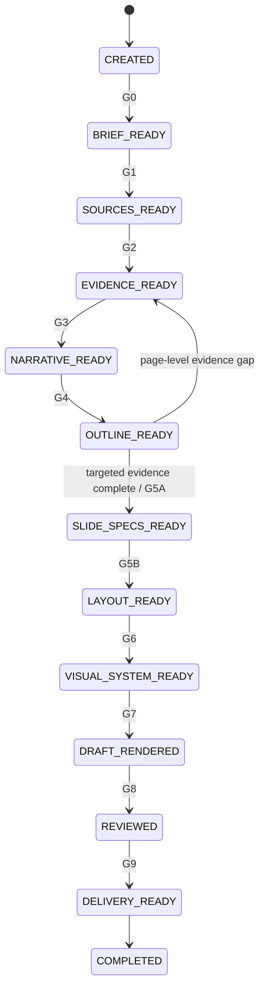

# 03｜Workflow and State Machine

## 1. 主流程



项目状态由两个正交字段组成：

- `current_phase`：最近一个已成立的流程阶段；
- `status`：`active / blocked / failed / cancelled / completed / degraded`。

`blocked` 不是独立 Phase。项目被阻断时保留当前 `current_phase`，把 `status` 设为 `blocked`，并在 `blockers` 中记录原因；解除阻断后恢复 `active`，再从原阶段继续。阶段不是“模型说完成了”，而是 Gate 通过后的持久化结果。

## 2. 阶段合同

| Phase | 主要问题 | 输入 | 输出 | Gate |
|---|---|---|---|---|
| P0 Intake | 为什么做、给谁看、什么约束 | 用户请求、初始素材、允许时的方向性扫描 | Project Brief | G0 Brief |
| P1 Sources | 有哪些可用资料 | 文件/链接/既有 deck/方向性研究来源 | Source Ledger | G1 Sources |
| P2 Evidence | 哪些声明有依据 | Sources、方向性研究、逐页定向研究 | Evidence Ledger | G2 Evidence；P5A 前再次确认 |
| P3 Narrative | 整套演示如何说服 | Brief、Evidence | Narrative Blueprint | G3 Narrative |
| P4 Outline | 每一页承担什么任务 | Narrative | Deck Outline | G4 Outline |
| P5A Slide Specs | 每页讲什么及用何种语义载体 | Outline、Evidence、（designed Create 时）已审阅的 Art Direction Seed | Slide Specs；reviewed/critical 使用 0.2 representation grammar | G5A Specs |
| P5B Layout | 载体如何形成阅读、焦点和几何关系 | Slide Specs | Layout Plans、wireframes；reviewed/critical 另有 semantic previews 与 qualitative planning decision | G5B Layout |
| P6 Visual | 整套可执行视觉语法是什么 | Brief、参考、Layout、Assets、同一 Seed | immutable Art Direction Packet、Visual System、完整 page designs | G6 Visual |
| P7 Render | 如何以已准入 producer 机械实现 | Specs、Layout、Visual、完整 Renderer IR | Render Manifest/draft；Designed Create sample/full candidate receipts | G7 Render |
| P8 Review | 真实目标渲染后具体哪里有问题 | Office-rendered pages、所有 current artifacts | immutable visual review/decision、Quality Report、repair plan | G8 Review |
| P9 Delivery | 交付是否完整 | approved draft | Delivery Manifest | G9 Delivery |

### 2.1 MVP 动作完整性

在 MVP 路径中，P5B 的策划稿、P7 的调试性 PPTX、设计预览和最终 PPTX 是不同产出。把同一策划内容保存为 `.pptx` 不构成新的阶段完成。`Render Manifest.pipeline_stages` 与 `outputs[].role` 记录每个动作；G7 检查非审阅阶段，G8 检查调试稿和最终稿的独立预览。

## 2.2 双阶段研究回路

研究不是只在流程中单点执行：

1. **方向性扫描**发生在正式提问之前或 P0/P1 期间，用于理解领域、时效、受众关切和素材缺口；它只形成证据基线。
2. **逐页定向补全**发生在 P4 大纲之后，因为此时才能知道每页真正需要证明什么。
3. 若逐页补全新增、推翻或改变了关键证据，执行 `OUTLINE_READY → EVIDENCE_READY`，随后重新通过 P3/P4 的一致性检查。
4. 只有定向证据缺口被解决、明确限定或获得授权 waiver 后，才进入 P5A。

这是一条显式返工边，不是跳过状态机；Evidence Ledger 仍是唯一证据事实源。

## 2.3 M3 Production planning 回路

M3 的单一应用链为：

```text
Brief completion / G0
  → M2 orientation / G2
  → Narrative / G3
  → stable Outline / G4
  → Slide Specs
  → M2 targeted Evidence / G5A
  → Layout + immutable wireframes / G5B
  → Planning Review / bounded Repair
```

- Production Narrative、Outline、Specs、Layout 都携带 `planning_lineage`，绑定当前上游 artifact version/content hash、provider、proposal 与 policy；
- `S-*` 是稳定页面身份，ordinal 只是顺序；insert/exclude/reorder/split/merge/freeze/update 产生 `PCH-*`，并只失效依赖该 Outline 的下游；
- Planning Review 产生 `PRV-*`，把具体问题定位到 P0/P2/P3/P4/P5A/P5B 中最早责任阶段；
- P0/P2/P3/P4/P5A/P5B 映射是状态机中的单一来源；从 Layout 或更后阶段均可回到更早责任阶段，回到当前 owner 为幂等停留；
- 自动 Repair 只处理已显式准入的 deterministic 问题，产生 `PRP-*`，并重跑 G2/G3/G4/G5A/G5B 与全套 Planning Review；
- assisted/manual 问题不自动改写语义，而是正式路由到最早责任阶段；
- `M3 Application Report` 的 planning level P0/P2/P3/P4/P5A/P5B 必须与最终 Project State 一致，部分失败不能冒充 P5B。

M3 Exit 是仓库级 Gate，不加入 deck G0–G9。它只证明不做最终视觉时，结构、证据、页面语义、几何和灰模已可审阅。

### 2.4 Designed Create 的视觉质量前置事务

Reviewed/critical Designed Create 不把“Gate 没阻断”当成视觉质量证明。Workflow 从精确 Brief 派生 immutable `VisualAdmissionPolicy`，并在 Outline 后按下列顺序执行：

```text
Taste-driven native prototype + direction review
  → frozen ArtDirectionSeed
  → full-deck Slide Specs 0.2 representation grammar
  → full-deck Layout Plans 0.2 + semantic planning previews
  → qualitative planning review/decision
  → closed ArtDirectionPacket/Visual System 0.2
  → one complete Renderer IR 0.2
  → deterministic representative selection
  → scope=sample Artifact Tool render from that IR
  → real PowerPoint pages + immutable review/derived decision
  → scope=full render from the identical IR/producer
  → whole-deck PowerPoint review/decision
```

校准是 P6 与 full P7 之间的 supporting transaction，不新增 Project State phase。Sample 保持 `VISUAL_SYSTEM_READY` 且不满足 G7；只有同一完整 IR/producer 获得 current calibration authorization 后才允许 full render。任何 Specs、Layout、Visual、IR、asset、font、producer 或 Office profile 变化都会使旧授权失效。

## 3. Gate 语义

### M1 当前记录

`gates/gate_results.json` 是独立、可版本化的 Gate 历史事实源，保存：

- Gate record ID、Gate ID 与状态；
- 输入 artifact type/path/version/hash；
- check results、severity 和 issue refs；
- 审批者、时间戳、waiver reason 和 notes。

`project_state.completed_gates[]` 只保存每个 Gate 的最新阶段控制摘要，并通过 `gate_record_id` 指回完整记录。Gate 输入版本落后于当前 registry 时，阶段校验报告 `stale_phase_gate`，不能继续推进。

Critical 规则不能被 waiver。Major waiver 只允许显式审批者、原因和 issue refs，并必须在 Delivery Manifest 中披露。

阶段推进还必须校验 Gate 与专属审计产物的一致性。尤其是 `REVIEWED` 及其后续阶段，`Quality Report.gate_result` 必须明确记录通过的 `G8`；P6 产生的 G6 规划审计不能复用为最终视觉审计。`DRAFT_RENDERED` 及其后续阶段必须对应成功 Render Manifest，`DELIVERY_READY` 及其后续阶段必须对应 ready/delivered Delivery Manifest。

## 4. 审批模式

### Auto

适合低风险草稿。阶段自动推进，但仍写入全部 artifacts 和 Gate 结果。

### Checkpoint

默认模式。在以下节点等待用户或主代理确认：

- Project Brief；
- Deck Outline；
- Layout wireframes；
- 最终视觉草稿。

### Strict

适合高价值、法律、财务、医疗、董事会和外部发布材料。每个 Gate 都需要显式批准，研究与来源要求更高。

## 5. 返工路由

问题应回到最早产生它的阶段：

| 问题 | 返回阶段 |
|---|---|
| 目标或受众错误 | P0 |
| 缺少关键文件 | P1 |
| 事实无支持/冲突 | P2 |
| 故事线不成立 | P3 |
| 页数、节奏或重复 | P4 |
| 主题解读、参考取舍或原生样板方向错误 | Design Direction Prototype / ArtDirectionSeed |
| 单页命题/内容块错误 | P5A |
| 元素关系、密度、构图错误 | P5B |
| 字体、颜色、风格错误 | P6 |
| 溢出、碰撞、导出错误 | P7 |
| 审计遗漏或修复回归 | P8 |

禁止在 P7 用缩小所有文字的方式掩盖 P5 的内容过载。

M2.5 将 Evidence gap 返工实现为正式 Runtime 事务：

- Gap Report 绑定当前 Brief/Source/Evidence/Outline/Specs 版本；
- 只允许从 `OUTLINE_READY` 或 `SLIDE_SPECS_READY` 回到 `EVIDENCE_READY`；
- 保留 G0–G2，移除后续 Gate 摘要；
- Narrative、Outline、Slide Specs 与后续 staged artifacts 标为 draft；
- 返工原因写入 Decision Log；
- 输入版本在事务锁内再次核对，过期报告不能路由状态。

M3 将策划返工拆成两类：

- **显式数字便利贴操作**：Outline 与 Change Report 在同一事务提交；stable Slide IDs 和 mappings 保留页面历史；
- **Planning Review/Repair**：Review 绑定当前六类规划事实，Repair 绑定选中 issues、limits、provider 和 result Review；中断后保留最后一个有效阶段，M3 Application 发布 failed/rework report。

改变 Outline 会使 Specs/Layout/Visual/Render/Review/Delivery draft，但不会无故重写 Narrative 或 Evidence；事实缺口仍回 P2，故事线问题回 P3，页面职责问题回 P4，内容块问题回 P5A，几何容量问题回 P5B。

上游写入、阶段/Gate 回滚与下游 `draft` 标记属于同一 journaled graph transaction。`draft` 下游保留自身 Schema/hash/registry 约束，但其过时的跨 artifact 引用只形成 warning；重建并批准时恢复 error 级约束。Host Create 还允许直接修订 `ArtDirectionSeed`，请求显式绑定被替代的 Seed，不再通过扰动 Outline 间接触发。

### 5.1 Host Create 会话、续跑与显式修订

一次 designed Create 的初始输入写入 schema-backed Session。首次命令可携带 title、Sources 和 request；之后普通续跑只需：

```bash
slidethus create <workspace>
```

省略表示复用，显式差异不表示“新的补充说明”。若普通续跑传入不同 request、Source、limit 或 provider identity，调用会在生产 artifact mutation 前失败，并提示使用下列明确事务：

- `--revise-brief --request ...`：修改 Brief intent，重新进入 P0 owner；
- `--revise-sources --source ...`：显式新增或更新 canonical Sources，重新进入 P1/P2；
- `--revise-stage ...`：只修改指定 planning owner，原子失效正确 dependents，并可跨进程继续同一 revision；其他 Host request 未回答或该 revision 未完成时不得开始另一 revision/Render。

每个 planning revision request 都绑定被替代 artifact 的 version/content hash；旧 response 不能因为 stage 名相同而再次生效。Owning artifact 一旦提交，Session 立即清除 pending revision/request，再继续下游重建；后续失败不会重复提交同一修订。Source omission 不执行删除。

Resume 只能复用已被 current Gate 重新认可的 artifact。正文仍存在、Schema 通过或历史报告有效都不足以跳过阶段；必须同时满足 current Phase、accepted Gate、registry version/hash、provider/policy 和 upstream lineage。Targeted M2 report 还必须绑定 current Outline/Slide Specs。

每次 Create invocation 都先写 started operation，再闭合为一个 terminal operation。Planning Review 的 `rework_required` 必须直接返回 earliest target phase、Review path、具体 `PRI-*` issues 和允许的下一动作。Renderer attempt 仍由独立 candidate receipt 负责，二者不互相冒充。

Session 0.2 还固定 visual reviewer identity/capabilities 和 calibration state。Reviewed/critical 的 `--render` 首先从完整 IR 确定性选取代表页，产出 sample receipt 并停在 `calibration_office_evidence_pending`；注册真实 PowerPoint 页面后产生 immutable review、workflow-derived decision 与 evidence-only ReferenceSet。批准后下一次 resume 才能执行 full render；full candidate 再停在 `full_deck_office_evidence_pending`，直至 whole-deck decision 成立。直接指定 `--slide-id` 不能替代该事务。

同一 page hash 上已经 admitted 的 Critical/Major finding 不能因漏报、降级或切换 reviewer 消失。真正修复必须改变页面 hash；事实误判只能通过保留原 finding 的 immutable adjudication 关闭。任何 full-render 入口都必须调用共享 `RenderAdmissionPolicy`，不能只依赖 Host Create 的编排状态。

## 6. 局部重生成

每个 slide 和 block 都有稳定 ID。局部修改流程：

1. 锁定变更对象和反馈；
2. 找到其上游 evidence、slide spec、layout 与 visual token；
3. 判断最早受影响阶段；
4. 只失效依赖该对象的下游 artifacts；
5. 重生成并渲染；
6. 对该页做局部审计；
7. 对全 deck 做跨页一致性回归。

## 7. 并发模型

可以并行：

- 不同来源解析；
- 不同查询的研究；
- 已冻结 outline 后的独立 slide spec 草拟；
- 不同审计维度的只读检查；
- 不同页的渲染。

必须串行或统一合并：

- Project Brief 决策；
- Narrative Blueprint；
- Deck Outline 顺序；
- Visual System；
- Gate 状态和 artifact registry；
- 跨页修复决策。

## 8. 失败状态

- **blocked**：缺少用户输入、工具或权利；可恢复。
- **failed**：执行错误或 artifact 不一致；必须修复后重试。
- **cancelled**：用户停止；保留已完成 artifacts。
- **degraded**：按能力矩阵输出部分结果；必须声明缺失交付。

失败不能把项目状态推进到后续阶段。

## 9. 可恢复执行

Artifact Runtime 保证：

- artifact 写入原子化；
- 状态迁移和 artifact 版本在同一事务语义内；
- 中断后可从最后一个通过的 Gate 恢复；
- 临时文件不被识别为正式 artifact；
- 重试不会静默覆盖人工修改；
- 每次修复保留可比较版本。

事务 journal、历史快照与锁文件保存在 workspace 的 `.slidethus/` 中；正式 artifact 路径不变。`artifact recover` 会确认完整且有效的提交，或回滚不完整/无效的提交。
