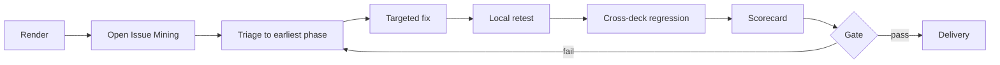

# 05｜Quality System

## 1. 质量不是一个总分

PPT 质量包含事实、叙事、页面语义、视觉、演讲和交付完整性。单一平均分会掩盖关键缺陷，因此 Slidethus 使用：

1. 确定性检查；
2. 开放问题发现；
3. 修复；
4. 维度评分；
5. Gate；
6. 回归。

## 2. 审计顺序

### Round A｜Open Issue Mining

不设置评分维度，不先看已有分数。要求 reviewer 直接指出：

- 具体位置；
- 发现了什么；
- 为什么是问题；
- 应回到哪个阶段修复；
- 如何验证修复。

这样避免“先打高分，再为分数找理由”。

### Round B｜Dimension Scorecard

Round A 的 Critical/Major 问题修复后，再按维度评分。评分必须引用实际 artifact、页面或测试结果。

## 3. 严重度

| Severity | 定义 | Gate |
|---|---|---|
| Critical | 事实错误、误导、重大缺失、无法打开、严重越界、法律/安全问题 | 必须为 0 |
| Major | 叙事断裂、页面不可读、核心结论无证据、跨页严重不一致、编辑等级不符 | 必须为 0，明确 waiver 除外 |
| Minor | 局部文案、对齐、间距、措辞或非关键一致性问题 | 可记录交付 |
| Suggestion | 可选优化 | 不阻断 |

## 4. 确定性检查

### 4.1 Artifact

- JSON Schema；
- required files；
- ID uniqueness；
- cross references；
- state transition；
- artifact version/hash；
- Source Snapshot key、file hash、Chunk/Risk identity、parse status 与 Ledger lineage；
- Gate input version。

### 4.2 Evidence

- unsupported/disputed claim 使用；
- source locator、Chunk ID 或内容哈希缺失/漂移；
- Candidate binding 与 candidate/source refs 不一致；
- claim normalization 删除单位、百分比、小数、比率或正负号导致误合并；
- `partial` 来源的 warning/覆盖边界未进入 use policy；
- 把未执行的公式、未打开的链接/嵌入对象、图片元数据或未 OCR 页面误写成已验证事实；
- stale research、TTL/provider lineage 或 semantic cycle completion 不一致；
- explicit conflict group 只阻断部分成员；
- Research summary 未抓取正文却被标为 verified；
- 单位、时间口径和数据范围；
- 引用与页面声明不一致。

### 4.3 Content

- headline/takeaway 缺失；
- 重复页面；
- 页面数量越界；
- 内容块过多；
- 字数/密度预算；
- speaker notes 与页面冲突。

### 4.4 Production Planning

- Brief completion input/context/result hash 与 open question/assumption policy；
- Narrative thesis、arc、objections、proof strategy、section budget 和 call to action；
- `planning_lineage` 是否绑定 current upstream artifacts/provider/policy；
- stable Slide/Block/Region IDs、active ordinals 与 excluded history；
- Change Report request/policy/idempotency/output lineage；
- factual Slide/Block 的 Evidence subset 与 qualification；
- headline/takeaway 近重复、连续同类页面、transition 和 estimated duration；
- content density、primary-block competition；
- layout family、Block/Region 一一覆盖、safe area、collision、capacity 和 min font floor；
- Planning Review 是否绑定最终 planning artifacts；
- Repair 是否绑定 current Review、limits/provider，并重跑全套 planning regression。

M3 Planning Review 的 Critical/Major 必须为 0 才能通过 repository M3 Exit。Minor 可以保留为显式 warning，但不能被自动评分掩盖。该报告不是 P8 最终视觉 Quality Report。

### 4.5 Layout/Render

- canvas/safe area；
- overlap/collision；
- clipping/overflow；
- reading order；
- minimum font size；
- contrast；
- missing fonts/assets；
- broken SVG/PPTX；
- export page count；
- preview rendering。
- complete-MVP stage/output coverage；
- debug PPTX Region/Block mapping；
- debug 与 final 两条独立 Office preview 链。

## 5. 语义审计维度

| 维度 | 核心问题 |
|---|---|
| Purpose fit | 是否服务用户想要的行动或决策 |
| Audience fit | 语言、深度、异议和利益是否匹配受众 |
| Factual integrity | 声明是否准确、可追溯、口径一致 |
| Narrative coherence | 章节与页面是否形成因果、递进或论证 |
| Slide clarity | 每页是否有唯一核心命题 |
| Evidence sufficiency | 关键结论是否有足够证据 |
| Presentation usability | 现场讲述是否有节奏、过渡和备注 |

## 6. 视觉审计维度

| 维度 | 核心问题 |
|---|---|
| Hierarchy | 第一眼是否看到最重要信息 |
| Readability | 字号、对比、行长、图表和投影环境是否可读 |
| Composition | 平衡、对齐、留白和视觉重心是否成立 |
| Consistency | Token 与组件跨页是否一致 |
| Diversity | 布局是否随内容变化，避免机械重复 |
| Asset quality | 图片、图标、图表是否清晰且风格一致 |
| Editability | 输出是否符合承诺的编辑等级 |
| Export integrity | PPTX/PDF/PNG 是否一致、无缺失和替代异常 |

## 7. 评分规则

0—不可用；1—严重不足；2—明显缺陷；3—基本可用；4—成熟；5—优秀。

通过建议：

- 所有维度 ≥ 3；
- 核心维度（事实、叙事、可读性、导出）≥ 4；
- Critical = 0；
- Major = 0；
- 所有 waiver 在 Delivery Manifest 明示。

分数不能覆盖严重度规则。

Quality Report 可以用于前置规划审计，但最终 P8 Review 必须生成或更新一份 `gate_result.gate_id = G8` 且状态为 `pass` 的报告。仅记录 G6、G5B 等前置 Gate 的报告，即使自身 `status = pass`，也不能使项目进入 `REVIEWED` 或通过 G8。

## 8. 防止模板化和 Bento 滥用

检测：

- 连续三页相同 slide type 或 layout family；
- 全 deck 超过 40% 页面使用 Bento；
- 不同内容只换颜色不换信息结构；
- 关键 statement 被拆成多个小卡片；
- 流程、时间、关系和数据被强行卡片化；
- 每页信息块数量过度一致。

页面职责/节奏问题回 P4，内容容量问题回 P5A，空间关系问题回 P5B，视觉 token 问题才回 P6；不能只换皮肤。

## 9. 修复闭环

## 10. Golden corpus

M5 应建立至少以下评测集：

- 纯文字长文 → 培训课件；
- 年报/表格 → 高管汇报；
- 多来源冲突 → 研究简报；
- 既有 PPT → 重构；
- 品牌模板 → 风格提取；
- 无联网/无图片生成 → 降级；
- 中文、英文和双语；
- 10、30、80 页规模；
- 单页修复与全 deck 回归。

每个 case 同时保存 artifacts、预期 Gate、参考输出和已知容差。
