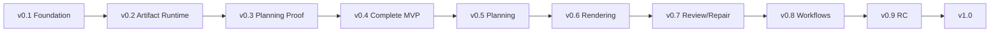

# 09｜Roadmap

## v0.1 Foundation

目标：Skill、合同、状态、Gate、示例和 Codex 接手能力成立。

已完成：本基础包。

## v0.2 Artifact Runtime

目标：可靠项目状态与产物版本。

关键产出：

- artifact registry；
- atomic persistence；
- migrations；
- dependency invalidation；
- gate history；
- recovery tests。

## v0.3 Planning Proof

目标：以可替换 MinimalImpl 证明从本地文本到结构化策划稿及其 PPTX 预览的链路。

关键产出：

- Markdown/TXT + line locators；
- 用户来源限定 evidence；
- 规则式 narrative/page planning；
- python-pptx 策划稿预览；
- LibreOffice 可行性验证。

该版本不再称为完整 MVP，因为调试、设计和最终渲染没有形成不同产出。

## v0.4 Complete Action-Chain MVP

目标：让每个基本动作都有独立产出物和验收。

关键产出：Planning SVG、Layout Diagnostics、Debug PPTX/PNG、Design SVG、Final PPTX/PNG，以及逐阶段 Render Manifest。

## v0.5 Planning Pipeline

目标：从素材到经审计的页面策划稿。

当前进展（2026-08-27）：M2.1–M2.7 与 M3.1–M3.7 已完成。M2 提供 multi-format Source、two-pass Research、policy-bearing Evidence、block binding/gap/rework 和 application boundary；M3 提供 minimum-question Brief、provider-neutral Production Narrative/Outline/Specs/Layout、stable digital sticky notes、immutable wireframes、Planning Review、bounded local Repair 和 M3 Application Report。

M2 Production boundary：

- [x] multi-format ingestion 与 source inventory；
- [x] stable Chunk/locator/hash 与 immutable Source Snapshot；
- [x] resumable two-pass Research Runtime；
- [x] query/task/cache/invalidation/offline lineage；
- [x] deterministic Evidence Engine 与 conflict/freshness/authority/use policy；
- [x] block-level Evidence binding、Gap Report 与 P2 rework；
- [x] application capability/degradation/security integration；
- [x] repository-wide audit and M2 Exit Gate。

M3 Production planning boundary：

- [x] Project Brief 智能补全、最少提问和 answer/resume；
- [x] current Brief/Evidence-bound Narrative Blueprint；
- [x] stable `S-*` digital sticky-note insert/exclude/reorder/split/merge/freeze/update；
- [x] Evidence-qualified Slide Specs 与 stable Blocks；
- [x] relationship-driven Layout Plans、geometry/capacity checks 与 immutable wireframes；
- [x] density/duplicate/rhythm/transition Planning Review；
- [x] bounded local Repair、dependency propagation 和 failure checkpoint；
- [x] repository-wide audit and M3 Exit Gate。

**M2 Exit Gate 与 M3 Exit Gate：PASS（2026-08-27）。** 证据见 `audit/M2-BUILD_REPORT.md`、`audit/M3-round-2-scorecard.md` 与 `audit/M3-BUILD_REPORT.md`。v0.5 完成不代表 M4 Production rendering 或 M5 independent visual repair 已完成。

## v0.6 Rendering

目标：至少两种可替换渲染后端。

关键产出：

- [x] Final SVG；
- [x] PptxGenJS Native 与 Hybrid；
- [x] asset/chart/table/image pipeline；
- [x] SVG → PNG/PDF preview/export；
- [x] overflow/collision/safe-area preflight；
- [x] measured editability + Production Render Manifest；
- [x] M4 Application/CLI 与 repository-wide Exit Gate。

**M4 Exit Gate：PASS（2026-08-28）。** 同一 Renderer IR 已由三个 Production backend 消费，M2/M3 semantic/planning Schemas 不因 backend 切换而改变。证据见 `audit/M4-round-2-scorecard.md` 与 `audit/M4-BUILD_REPORT.md`。Office/Poppler preview 仍是 host capability，不把缺失环境能力等同于 M5 视觉审计失败。

## v0.7 Review and Repair

目标：全 deck 可自动发现问题、定位阶段并局部修复。

M5 按七个稳定子模块推进：

- [x] M5.1 Deterministic Review Core：独立 workspace/G0–G7/render lineage、真实输出覆盖、PPTX reopen、editability/capability 审计；
- [x] M5.2 Open Issue Semantic Review：无评分问题发现与最早责任阶段定位；
- [x] M5.3 Dimension Scorecard：Round A 后评分，不能覆盖 blocking severity；
- [x] M5.4 Full-page Visual Review：真实页面 preview 与跨页视觉审计；
- [x] M5.5 Repair Plan & Regeneration：最小影响 repair plan 与 phase-correct regeneration；
- [x] M5.6 Cross-deck Regression：局部/全 deck 回归、Quality Report 聚合与 G8；
- [x] M5.7 Golden Deck & M5 Exit：golden corpus、M5 Application/CLI、Round A/B 与 repository Exit。

M5 Review runtime facts 位于 `.slidethus/review/`，Production Quality Report 聚合 current deterministic/semantic/scorecard/visual/repair/regression lineage 并驱动 G8。M5 Review 与 M4 renderer 保持独立；M4 Preflight/G7/preview 是 review 输入，不等于 G8 视觉质量结论。执行计划见 `plans/M5-review-repair-loop.md`，架构见 ADR-0020。

**M5 Exit Gate：PASS（2026-08-29）。** Round A 的 Major/Blocking Minor 均已根修，无 waiver；M2/M3/M4 Exit 保持 PASS。下一里程碑为 M6 Productization and Distribution。

## v0.8 Multi-workflow

目标：Create、Rebuild、Improve、Audit、Revise、Extract Style 稳定可用，并形成可观测、可分发的产品入口。

- [x] M6.1 Multi-workflow Runtime：统一 `WorkflowApplicationService`、immutable `WFR-*`、Create/Rebuild/Improve/Audit/Revise/Extract Style 与 `workflow run/list/show`；
- [x] M6.2 Operational Controls：structured events、cache/budget、concurrency/lease/recovery；
- [x] M6.3 Plugin Packaging；
- [x] M6.4 Examples & Evaluation；
- [x] M6.5 License & Third-party Policy；
- [ ] M6.6 v1.0 Preview Hardening & Release Gate：Round 6 PASS 已被真实 Office 视觉证据撤回；Round 7 根修已生成新的实际 PPTX，等待用户视觉评审。

**M6 Exit Gate：REOPENED（2026-08-30）。v1.0 Release Gate：DO NOT RELEASE。** `SYN-2F199C4F136F5876` 记录了四个新的 Major systemic candidates；Round 7 证据见 `audit/M6.6-round-7-office-visual-reopen.md`。

## v0.9 Distribution Candidate

目标：Plugin 包、文档、示例、许可证、供应链和兼容矩阵完成。

## v1.0

发布条件：

- 核心 workflows 通过 golden corpus；
- 多宿主验证；
- 至少两个 render backend；
- Critical/Major 发布阻断问题为零；
- 文档与自动审计一致；
- 来源和资产权利策略完成；
- 可恢复执行和局部返工通过故障注入。

## 里程碑依赖

不得为了演示视觉效果跳过 Artifact Runtime 和 Planning Pipeline。
