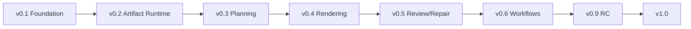

# 09｜Roadmap

## v0.1 Foundation

目标：Skill、合同、状态、Gate、示例和 Codex 接手能力成立。

已完成：本基础包。

## v0.2 Artifact Runtime

目标：可靠项目状态与产物版本。

关键产出：

- artifact registry；
- atomic persistence；
- migrations；
- dependency invalidation；
- gate history；
- recovery tests。

## v0.3 Planning Pipeline

目标：从素材到经审计的页面策划稿。

关键产出：

- multi-format ingestion；
- evidence engine；
- narrative and outline；
- slide spec/layout generation；
- interactive checkpoints；
- wireframe review。

## v0.4 Rendering

目标：至少两种可替换渲染后端。

关键产出：

- final SVG；
- PptxGenJS hybrid；
- asset and chart pipeline；
- preview renderer；
- overflow/collision tests；
- editability report。

## v0.5 Review and Repair

目标：全 deck 可自动发现问题、定位阶段并局部修复。

关键产出：

- semantic review；
- visual review；
- repair planner；
- regression；
- golden corpus；
- quality dashboard artifacts。

## v0.6 Multi-workflow

目标：Create、Rebuild、Improve、Audit、Revise、Extract Style 稳定可用。

## v0.9 Distribution Candidate

目标：Plugin 包、文档、示例、许可证、供应链和兼容矩阵完成。

## v1.0

发布条件：

- 核心 workflows 通过 golden corpus；
- 多宿主验证；
- 至少两个 render backend；
- Critical/Major 发布阻断问题为零；
- 文档与自动审计一致；
- 来源和资产权利策略完成；
- 可恢复执行和局部返工通过故障注入。

## 里程碑依赖

不得为了演示视觉效果跳过 Artifact Runtime 和 Planning Pipeline。
